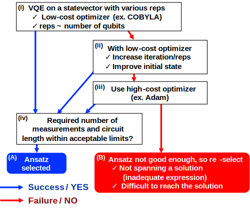
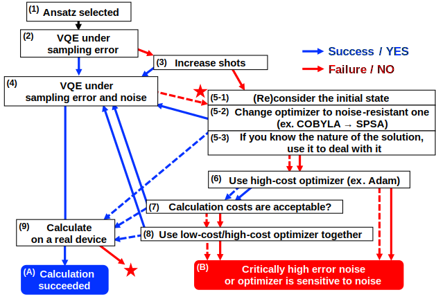

# Code for VQE calculation

## About this Repository
In this repository, we provide an example code for electronic structure calculations using the variational quantum algorithm (VQA), especially the variational quantum eigensolver (VQE), which performs ground state calculations, using the Qiskit package. In addition, strategies for efficiently determining the computational conditions for the VQE will be presented.

## How to perform VQE

### Execution Environment
We have confirmed that the code can be run with numpy 1.21.5, qiskit 0.37.0, qiskit_experiments 0.3.1, qiskit_ibm_runtime 0.6.0, and scipy 1.7.3.

### Quick Start
The program file is custom_vqe_2.py (a single py file due to Qiskit runtime limitations). It consists of a function definition part and an execution part, and when you directly execute as 
```
python custom_vqe_sample.py >& result.log &
```
the calculation written in the execution part `if __name__ == “__main__”` is executed. To perform other calculations, simply execute the `main` function from a separately created input file as follows (when using a simulator). 
```
import json, sys
import numpy as np
from qiskit import Aer
from qiskit.circuit.library import RealAmplitudes
from qiskit_ibm_runtime.program import UserMessenger
from qiskit_ibm_runtime import RuntimeEncoder, RuntimeDecoder
sys.append(“Path to the directory containing the custom_vqe_2.py”) import custom_vqe_2

backend = Aer.get_backend("aer_simulator_statevector")
user_messenger = UserMessenger()
qubit_ops = [
	[('II', (-76.76631916830594+0j)), ('IZ', (0.1545406433989221+0j)),
		('ZI', (-0.15454064339892248+0j)), ('ZZ', (-0.00329890469082067+0j)),
		('XX', (0.17216032212807028+0j))],
	[('II', (1.9999999999999993+0j))],
	[('II', (0.5000000000000003+0j)), ('ZZ', (0.49999999999999706+0j)),
		('YY', (0.4999999999999999+0j)), ('XX', (-0.49999999999999994+0j))],
	[('II', 0j)],
	[('II', (5893.145174330428+0j)), ('IZ', (-23.726013081567196+0j)),
		('ZI', (23.72601308156723+0j)), ('ZZ', (0.45872391987841965+0j)),
		('YY', (0.001135880988483606+0j)), ('XX', (-26.43222847320362+0j))]]
ansatz = RealAmplitudes(2, entanglement="linear", reps=1) 
init_prm = np.ones(ansatz.num_parameters)
inputs = {}
inputs["qubit_ops"] = qubit_ops 
inputs["ansatz"] = ansatz 
inputs["init_prm"] = init_prm 
inputs["options"] = {
	"shots":8192, 
	"method":"COBYLA", 
	"readout_mitigation":False, 
	"seed":50,
	"state_tomo":True,
	"ro_miti_for_st":False}
inputs["opt_options"] = {"tol":1e-4, "maxiter":100}
serialized_inputs = json.dumps(inputs, cls=RuntimeEncoder)
deserialized_inputs = json.loads(serialized_inputs, cls=RuntimeDecoder)
res = custom_vqe_2.main(backend, user_messenger, **deserialized_inputs)
```
If a real device is used, the program can be uploaded in advance and then executed as follows. 
```
from qiskit_ibm_runtime import QiskitRuntimeService
...
service = QiskitRuntimeService()
program_id = “Program id assigned at upload”
# serialized_inputs = json.dumps(inputs, cls=RuntimeEncoder)
# deserialized_inputs = json.loads(serialized_inputs, cls=RuntimeDecoder)
options = {"backend_name": "Name of the device used for calculation"} 
job = service.run(program_id, options=options, inputs=inputs) 
res = job.result()
```
The `backend`, `user_messenger`, and `inputs` are required to run the calculation. The `backend` specifies the execution environment of the quantum circuit, and the `inputs` specifies the details of the calculation. The possible settings for `inputs` are described in the next section.

### keys for "inputs"
All settings except the `backend` and the `user_messenger` are passed through the variable `inputs` of dicionary type. The following keys can be specified in the `inputs`.
- `qubit_ops`: `list(list(tuple(str, complex)))`, required: A list of Pauli operators for observables. The expectation value of the 0th element of the list is minimized by the VQA. When operators other than the Hamiltonian are used in a penalty term or VQE/AC, they must be passed in the order " $\hat{H}$, $\hat{N}$, $\hat{S}^{2}$, $\hat{S}_{z}$, $\hat{H}^{2}$".
- `ansatz` (QuantumCircuit, required): The ansatz circuit with assignable parameters. 
- `init_prm`(iterable(float), default = `np.ones(ansatz.num_parameters)`): Initial parameters for the VQA. If the length does not match `ansatz.num_parameters`, an error will occur. Default is `(1, ... , 1)`.
- `opt_options` (dict, default = `{“tol”: 10-4, “maxiter”: 100}`): Settings for the optimizer specified by `method` key in `options`. In the case of the optimizer implemented in SciPy, it is passed to the `options` argument of `scipy.optimize.minimize()` (the possible settings depend on the optimizer. See [SciPy documentation](https://docs.scipy.org/doc/scipy/reference/generated/scipy.optimize.minimize.html)). The following keys can be specified for optimizers that are not implemented in SciPy.
    - `SPSA`
        - `maxiter = 100`: Maximum number of iterations.
        - `tol = 1e-6`: If the deviations in the last 5 steps are less than `tol`, the calculation is considered to have converged.
        - `last_avg = 1`: Return the average of the last `last_avg` steps.
        - `callbacl_SPSA = True`: Whether callback functions are used or not.
        - NOTE: If `use_jac = True` is specified in `options`, [second-order SPSA](https://doi.org/10.1109/CDC.1997.657661) is used.
    - `gradient-descent`
        - `maxiter = 100`: Maximum number of iterations.
        - `tol_prm = 1e-6`: If the change in the parameters are less than `tol`, the calculation is considered to have converged.
        - `gtol = 1e-6`: If the change in the gradient compared for each element is less than `gtol`, the calculation is considered to have converged.
    - `Adam`
        - `maxiter = 100`: Maximum number of iterations.
        - `alpha = 0.001`, `beta1 = 0.9`, `beta2 = 0.999`, `epsilon=1e-8`: Hyperparameters for the Adam. 
        - `tol_prm = 1e-6`: If the change in the parameters are less than `tol`, the calculation is considered to have converged.
        - `gtol = 1e-6`: If the change in the gradient compared for each element is less than `gtol`, the calculation is considered to have converged.
        - `calculate_zeroth = False`: Measure the cost function as well as the gradient when updating parameters.
- `state_index` (int, defalut = `0`): Indicates the state to be calculated (ground state is `0`). Not used internally.
- `options`: (dict, default = `{}`): All other settings are written in this dictionary. The following items can be set.
    - `shots` (int, default= `1024`): The number of shots in the expectation value calculation. If `backend` is `None` or statevector simulator, it is ignored.
    - `initial_layout` (list(list(int)), default = `None`): Specify the correspondence between theoretical and physical qubits. Passed to the `initial_layout` argument when creating the `QuantumInstance` object inside the program, see [Qiskit documentation](https://qiskit.org/documentation/stubs/qiskit.utils.QuantumInstance.html).
    - `method` (str, required(***No default specified***)): Optimizer used in the VQA. In addition to those implemented in SciPy (`Nelder-Mead`, `Powell`, `CG`, `BFGS`, `Newton-CG`, `L-BFGS-B`, `TNC`, `COBYLA`, `SLSQP`, `trust-constr`, `dogleg`, `trust-ncg`, `trust-exact`, `trust-krylov`), you can use `SPSA` (implemented in Qiskit), `gradient-descent`, and `Adam` (implemented in this program). For optimizers that require gradient measurements, it should be used in conjunction with `use_jac = True`.
    - `readout_mitigation` (bool, default = `False`): Apply matrix-based readout error mitigation (`qiskit.utils.mitigation.CompleteMeasFitter`). To use this, a simulator with a noise model or a real with must be used.
    - `readout_mitigation_period` (int, default = `10`): If `readout_mitigation = True`, this specifies how often the correction matrix is updated (in minutes).
    - `seed` (int, default = `50`): Random seed. Internally assigned to random(`random.seed()`), NumPy(`numpy.random.seed()`) and Qiskit(`algorithm_globals.random_seed`, `QuantumInstance.seed_simulator`, `QuantumInstance.seed_transpiler`).
    - `state_tomo` (bool, default = `False`): Perform quantum state tomography and purification. Finite shot simulators or real devices must be used.
	- `ro_miti_for_st` (bool, default = `False`): Apply matrix-based readout error mitigation (`qiskit.utils.mitigation.CompleteMeasFitter`) when `state_tomo = True`. To use this, you need to use simulators with a noise model or a real device.
    - `exclude_identity` (bool, default = `False`): Perform the VQA by excluding the terms of the identity operator from the zeroth observable (Hamiltonian).
    - `execute_vqd` (bool, default = `False`): Perform the VQD calculation (can also be used with the VQE/AC). Specify details in the following `vqd_settings`.
	- `vqd_settings` (dict): Detailed settings for the VQD calculation. The keys that can be specified are as follows. It is assumed that `qubit_ops` is given in the order " $\hat{H}$, $\hat{N}$, $\hat{S}^2$, $\hat{S}\_z$, $\hat{H}^2$".
	    - `cost` (dict, default = `{“overlap”:(ansatz,np.zeros(ansatz.num_parameters),0.0,1.0), “ssq”:(0.0,1.0)}}`): Specify penalty terms. The available penalty terms are as follows. 
	        - (`overlap`) (tuple(QuantumCircuit, iterable(float), float, float, str(optional))): Add a penalty term for overlap integral with a specified state. The elements of the tuple are in the order of (ansatz $\Phi$, parameters $\mathbf{\vartheta}$, target $tg$, coefficient $c$, note). If the note contains `"squared"`, a penalty term is added in the form
	        $$(|\langle\Psi(\mathbf{\theta})|\Phi(\mathbf{\vartheta})\rangle|^{2} - tg)^{2} \times c; $$
	        if not, a penalty term is added in the form
	        $$|\langle\Psi(\mathbf{\theta})|\Phi(\mathbf{\vartheta})\rangle|^{2} \times c \qquad (\mathrm{if}\quad tg = 0)$$
	        $$||\langle\Psi(\mathbf{\theta})|\Phi(\mathbf{\vartheta})\rangle|^{2} - tg| \times c \qquad (\mathrm{if}\quad tg \ne 0)$$
	        ($|\Psi({\mathbf\theta})\rangle$ is the state specified in the main VQA). Note that the key can be set freely as long as it contains `“overlap”` (it is also possible to add penalties between multiple states). 
	        - `ene`, `tot_n`, `ssq`, `sz`, `h_2` (tuple(float, float, str(optional))): Penalty terms for the observable $\langle\hat{O}\rangle$ ($\hat{O}$ = $\hat{H}$, $\hat{N}$, $\hat{S}^2$, $\hat{S}\_z$, $\hat{H}^2$ ). The elements of the tuple are in the order (target $tg$, coefficient $c$, note). If the note contains `“squared”`, a penalty term is added in the form
	        $$(\langle\hat{O}\rangle - tg)^{2} \times c;$$
	        if not, a penalty term is added in the form
	        $$\langle\hat{O}\rangle \times c \qquad (\mathrm{if}\quad tg = 0)$$
	        $$|\langle\hat{O}\rangle - tg| \times c \qquad (\mathrm{if}\quad tg \ne 0).$$ 
	        Note that `ene` and `h_2` are not intended to be used, although they work.
	    If `"inverse"` is specified in the notes for (`overlap`), `ene`, `tot_n`, `ssq`, `sz`, and `h_2`, $\tilde{c} = c/N_{\mathrm{opt}}$ is assigned as the coefficient for the number of optimization steps $N_{\mathrm{opt}}$ ($c$ is the coefficient value specified in the tuple). If `“cutoff-Ncut”`(`Ncut` = $N_{\mathrm{cut}}$ is an integer) is specified in the note, the coefficient of the penalty term is zero if the number of optimization steps exceeds $N_{\mathrm{cut}}$. Note that multiple keywords can be specified in the note at the same time. For example, to specify `“squared”`, `“inverse”` and `“cutoff-100”` at the same time, use underscores to connect them, as in `“squared_inverse_cutoff-100”` (in any order).
	- `execute_vqeac` (bool, default = `False`): Perform the VQE/AC calculations (can also be used with the VQD). Specify details in the following `vqeac_settings`.
    - `vqeac_settings` (dict): Detailed settings for the VQE/AC calculation. The keys that can be specified are as follows. It is assumed that `qubit_ops` is given in the order "$\hat{H}$, $\hat{N}$, $\hat{S}^2$, $\hat{S}\_z$, $\hat{H}^2$".
	    - `constraint` (dict, default = `{“overlap”:(ansatz,np.zeros(ansatz.num_parameters),0.0,1e-3),“ssq”:(0.0,1e-3)}}`): Specify constraints for the optimization. The available constraints are as follows. 
	        - (`overlap`) (tuple(QuantumCircuit, iterable(float), float, float)): Add a constraint for overlap integral with a specified state. The elements of the tuple are in the order of (ansatz $\Phi$, parameters $\mathbf{\vartheta}$, target $tg$, threshold $c$). The constraint is the form of
	        $$||\langle\Psi(\mathbf{\theta})|\Phi(\mathbf{\vartheta})\rangle|^{2} - tg| \le th$$
	        ($|\Psi({\mathbf\theta})\rangle$ is the state specified in the main VQA). The name of the key can be set freely as long as it contains `"overlap"` (it is also possible to add constraints between multiple states).
	        - `ene`, `tot_n`, `ssq`, `sz`, `h_2` (tuple(float, float)): Add constraints on the observable $\langle\hat{O}\rangle$ ($\hat{O}$ = $\hat{H}$, $\hat{N}$, $\hat{S}^2$, $\hat{S}\_z$, $\hat{H}^2$ ). The elements of the tuple are in the order (target $tg$, threshold $th$). The constraint is the form of
	        $$|\langle\hat{O}\rangle - tg| \le th.$$
	        Note that `ene` and `h_2` are not intended to be used, although they work.
    - `use_jac` (bool, default = `True`): Measure the gradients. It must be set to `True` for optimizers that use gradients  (it is automatically set to `True` for `gradient-descent` and `Adam`). Note that while gradient calculation is implemented for cost functions consisting of only observables, ***gradient calculation is not implemented for cost functions that include overlap integrals***.
    - `jac_settings` (dict, default = `{“shift”: np.pi/2, “sample_rate”: 1.0}`): Settings for the gradient measurement. Available when `use_jac = True`. The following keys can be specified.
        - `numetic` (bool, default = `False`): Evaluate the partial differentiation by taking the central difference with a small change in the parameter by the value specified by `delta`.
        - `delta` (float, default = `0.1`): Specifies the small change in the parameter when `numeric = True`.
        - `term` (int, default = `2`): Select the type of parameter shift method: 2 or 4 can be specified, and the partial derivatives are calculated by the 2-term and 4-term parameter shift methods, respectively. Note that the partial derivatives are computed as in
        $$\frac{\partial C(\theta)}{\partial\theta} = \frac{1}{2\mathrm{sin(shift)}}(C(\theta + \mathrm{shift}) - C(\theta - \mathrm{shift})) \qquad (\mathrm{2-term})$$
        $$\frac{\partial C(\theta)}{\partial\theta} = d_{0}(C(\theta + \mathrm{shift_0}) - C(\theta - \mathrm{shift_0})) - d_{1}(C(\theta + \mathrm{shift_1}) - C(\theta - \mathrm{shift_1})) \qquad (\mathrm{4-term})$$
        using the `shift` and `d` specified below (the cost function $C(\theta)$ is denoted as a function of the differentiating parameter $\theta$ only).
        - `shift` (float, default = `np.pi/2.0` (for 2-term), `[np.pi/2.0, np.pi]` (for 4-term)): Specifies the shift angle for the parameter shift method.
        - `d` (list(float), default = `[1.0/2.0, (np.sqrt(2)−1.0)/4.0]`): Specify the coefficients in the 4-term parameter shift method.
        - `sample_rate` (float, default = `1.0`): To reduce the cost of gradient measurement, set this parameter to randomly drop elements to be measured. A value between 0.0 and 1.0 must be specified; if 1.0 is specified, the partial derivatives for all parameters are measured (default), and if less than 1.0, the parameters are randomly selected in proportion to the value and their partial derivatives are measured.         
        - `padding` (str, default = `zero`): If `sample_rate` $\ne 1.0$ is specified, it specifies how to treat the elements of the gradients that are not measured. If `"zero"` is set, it is completed with 0.0, and if `"previous"` is set, it is completed with the gradients of the previous measurement (0.0 at the beginning).
- `options_2` (dict): Set only if the VQA calculation is to be performed again from the parameters obtained in the first VQA. Basically, any key that can be specified in the `options` can be specified (with different conditions).

### Defined Functions
- `main(backend, user_messenger, **kwargs)`
    - arguments
        - `backend (ProgramBackend)`: Execute quantum circuits
        - `user_messenger (UserMessenger)`: Output results
        - `kwargs`:
            - `qubit_ops (list(list(tuple(str, complex))))`: Observable Pauli operators
            - `ansatz (QuantumCircuit)`: Ansatz
            - `init_prm (np.array(float))`: Initial parameters for the VQA
            - `options (dict)`: The VQA calculation settings
            - `opt_options (dict)`: Optimizer Settings
    - return values
        - `res_list (list(dict))`: List of the VQA results

- `execute_vqe (qubit_ops, sampler, ansatz, user_messenger, init_prm, options, opt_options={}, state_index=0)`
    - arguments
        - `qubit_ops (list(list(tuple(str, complex))))`: Observable Pauli operators
        - `sampler (CiruictSampler)`: Perform expected value measurements
        - `ansatz (QuantumCircuit)`: Ansatz
        - `user_messenger (UserMessenger)`: Output results
        - `init_prm (np.array(float))`: Initial parameters for the VQA
        - `options (dict)`: The VQA calculation settings
        - `opt_options (dict)`: Optimizer Settings
        - `state_index (int)`: State index to be calculated (ground state is 0)
    - return values
        - `res (OptimizeResult)`: The VQA results

- `Adam (fun, x0, args, **kwargs)`
    - arguments
        - `fun (callable)`: Function to minimize
        - `x0 (np.array(float))`: Initial parameters
        - `args (tuple)`: (not used)
        - `kwargs (dict)`: Optimizer Settings
    - return values
        - `res (OptimizeResult)`: The VQA results

- `gradient_descent (fun, x0, args, **kwargs)`
    - arguments
        - `fun (callable)`: Function to minimize
        - `x0 (np.array(float))`: Initial parameters
        - `args (tuple)`: (not used)
        - `kwargs (dict)`: Optimizer Settings
    - return values
        - `res (OptimizeResult)`: The VQA results

- `SPSA_wrapper (fun, x0, args, **kwargs)`
    - arguments
        - `fun (callable)`: Function to minimize
        - `x0 (np.array(float))`: Initial parameters
        - `args (tuple)`: (not used)
        - `kwargs (dict)`: Optimizer Settings
    - return values
        - `res (OptimizeResult)`: The VQA results

- `state_tomography (ansatz, prm, sampler, ro_miti=False, seed=50, purify=True)`
    - arguments
        - `ansatz (QuantumCircuit)`: Ansatz
        - `prm (np.array(float))`: Parameters
        - `sampler (CircuitSampler)`: Perform expectation value calculations
        - `ro_miti (bool)`: Whether to apply the readout error mitigation
        - `seed (int)`: Random seed
        - `purify (bool)`: Diagonalize the measured density matrix to obtain pure states        
    - return values
        - `density_mat (DensityMatrix)`: Measured density matrix
        - `psi (np.arrray(float))`: Quantum state obtained by purification
        - `max_eig (float)`: Eigenvalue corresponding to `psi`

- `calc_overlap (prm1, prm2, ansatz1, ansatz2, *fargs)`
    - arguments
        - `prm1 (np.array(float))`: Parameters 1
        - `prm2 (np.array(float))`: Parameters 2
        - `ansatz1 (QuantumCircuit)`: Ansatz 1
        - `ansatz2 (QuantumCircuit)`: Ansatz 2
        - `fargs`:
            - `sampler (CircuitSampler)`: Perform expectation value calculations
            - `ansatz (QuantumCircuit)`: (not used)
            - `qubit_ops (list(list(tuple(str, complex))))`: (not used)
            - `disp (int)`: (not used)
            - `user_messenger (UserMessenger)`: Output results
    - return value
        - `result (complex)`: Overlap integral between two states

- `calc_expvals (prm, *fargs)`
    - arguments
        - `prm (np.array(float))`: Parameters
        - `fargs`:
            - `sampler (CircuitSampler)`: Perform expectation value calculations
            - `ansatz (QuantumCircuit)`: Ansatz
            - `qubit_ops (list(list(tuple(str, complex))))`: Observable Pauli operators
            - `disp (int)`: Print level (0-2)
            - `user_messenger (UserMessenger)`: Output results
    - return values
        - `result (list(float))`: Expectation value of the observables

- `calc_expvals_jac (prm, *fargs, previous_result=None)`
    - arguments
        - `prm (np.array(float))`: Parameters
        - `fargs`:
            - `jac_set (dict) = {“sample_rate”: 1.0, “term”: 2}`: Setting for the gradient measurement
            - `sampler (CircuitSampler)`: Perform expectation value calculations
            - `ansatz (QuantumCircuit)`: Ansatz
            - `qubit_ops (list(list(tuple(str, complex))))`: Observable Pauli operators
            - `disp (int)`: Print level (0-2)
            - `user_messenger (UserMessenger)`: Output results
        - `previous_result (np.array(float, float))`: The results of previous gradient measurements used to complete gradient elements when `sample_rate != 1.0` and `padding == "previous"`.
    - return values
        - `jac (np.array(float, float))`: Expectation value of the gradients

## VQE calculation strategy
The strategy for determining the calculation conditions in the VQE consists of the "Strategy for statevector calculation" and the "Strategy for dealing with noise and errors".

### Strategy for statevector calculation


The "Strategy for statevector calculation" is to perform a successful VQE calculation in an ideal environment (statevector simulator) without noise or errors. Starting from (i), the VQE calculation is performed according to the instructions in the frame, following the success/failure path down to the bottom. This will result in either "(A) Ansatz selected" or "(B) Ansatz not good enough, so re-select". In (A), the ansatz and the computational conditions under which the VQE calculation succeeds (in the statevector simulator) have been found, so you can proceed to the next "Strategy for dealing with noise and errors". In (B), the ansatz itself needs to be reviewed because even the noise-error-free statevector simulator cannot reach the exact solution.

### Strategy for dealing with noise and errors


In the "Strategy for dealing with noise and errors", by starting at (1) and following the instructions down, the calculation results are classified as either "(A) calculation succeeded" or "(B) Critically high error noise or optimizer is sensitive to noise". Note that the frames in the figure with multiple arrows going in and out represent solid lines going in and out of each other and dashed lines going in and out of each other. In (A), the calculation is successful (error less than 1 kcal/mol) on a real device with noise/error, and in (B), it is difficult to achieve the required accuracy in the VQE calculation under the conditions currently under consideration. If the calculation is classified as (B), it is necessary to review the ansatz structure and start over again with ansatz selection using the "Strategy for statevector calculation".

## 謝辞
The contents of this repository were created with the support of the Information-technology Promotion Agency (IPA) MITOU Target Program.