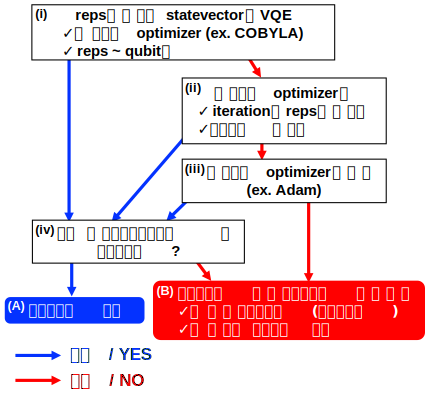
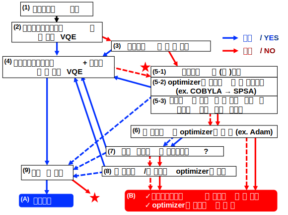

# VQE計算コード

## 本レポジトリについて
本レポジトリでは、変分量子アルゴリズム(variational quantum algorithm, VQA)による電子状態計算のうち、特に基底状態計算を行う変分量子固有値ソルバ(variational quantum eigensolver, VQE)の計算をQiskitパッケージを用いて実行するコード例を提供する。加えて、VQEの計算条件を効率よく決定するための戦略も紹介する。

## VQEの実行方法

### 実行環境
numpy 1.21.5, qiskit 0.37.0, qiskit_experiments 0.3.1, qiskit_ibm_runtime 0.6.0, scipy 1.7.3で実行できることを確認している。

### クイックスタート
プログラムファイルは custom_vqe_2.pyである(Qiskit runtimeの制約により、単一のpyファイルとしている)。プログラムファイルは関数定義部分と実行部分からなり、プログラムファイルを直接
```
python custom_vqe_sample.py >& result.log &
```
のように実行すると、実行部分`if __name__ == “__main__”`に書かれた計算が実行される。
他の計算を実行するには、別途作成したインプットファイルから
```
import json, sys
import numpy as np
from qiskit import Aer
from qiskit.circuit.library import RealAmplitudes
from qiskit_ibm_runtime.program import UserMessenger
from qiskit_ibm_runtime import RuntimeEncoder, RuntimeDecoder
sys.append(“custom_vqe_2.pyファイルのあるディレクトリへのパス”) import custom_vqe_2

backend = Aer.get_backend("aer_simulator_statevector")
user_messenger = UserMessenger()
qubit_ops = [
	[('II', (-76.76631916830594+0j)), ('IZ', (0.1545406433989221+0j)),
		('ZI', (-0.15454064339892248+0j)), ('ZZ', (-0.00329890469082067+0j)),
		('XX', (0.17216032212807028+0j))],
	[('II', (1.9999999999999993+0j))],
	[('II', (0.5000000000000003+0j)), ('ZZ', (0.49999999999999706+0j)),
		('YY', (0.4999999999999999+0j)), ('XX', (-0.49999999999999994+0j))],
	[('II', 0j)],
	[('II', (5893.145174330428+0j)), ('IZ', (-23.726013081567196+0j)),
		('ZI', (23.72601308156723+0j)), ('ZZ', (0.45872391987841965+0j)),
		('YY', (0.001135880988483606+0j)), ('XX', (-26.43222847320362+0j))]]
ansatz = RealAmplitudes(2, entanglement="linear", reps=1) 
init_prm = np.ones(ansatz.num_parameters)
inputs = {}
inputs["qubit_ops"] = qubit_ops 
inputs["ansatz"] = ansatz 
inputs["init_prm"] = init_prm 
inputs["options"] = {
	"shots":8192, 
	"method":"COBYLA", 
	"readout_mitigation":False, 
	"seed":50,
	"state_tomo":True,
	"ro_miti_for_st":False}
inputs["opt_options"] = {"tol":1e-4, "maxiter":100}
serialized_inputs = json.dumps(inputs, cls=RuntimeEncoder)
deserialized_inputs = json.loads(serialized_inputs, cls=RuntimeDecoder)
res = custom_vqe_2.main(backend, user_messenger, **deserialized_inputs)
```
のように`main`関数を実行すればよい(シミュレータを用いる場合)。実機を用いる場合は、あらかじめプログラムをアップロードした上で、
```
from qiskit_ibm_runtime import QiskitRuntimeService
(中略)
service = QiskitRuntimeService()
program_id = “アップロード時に付与されるプログラムid”
# serialized_inputs = json.dumps(inputs, cls=RuntimeEncoder)
# deserialized_inputs = json.loads(serialized_inputs, cls=RuntimeDecoder)
options = {"backend_name": "計算に使用するデバイス名"} 
job = service.run(program_id, options=options, inputs=inputs) 
res = job.result()
```
のように実行できる。計算の実行に必要なのは `backend`, `user_messenger`および`inputs`の3つであり、`backend`は量子回路の実行環境を、`inputs`は計算の詳細を指定する。`inputs`に設定可能な項目は次節で述べる。

### inputsの設定項目
`backend`, `user_messenger`以外の項目は`dict`型の変数`inputs`を通じて渡す。`inputs`に指定可能な項目は以下の通り。
- `qubit_ops`: `list(list(tuple(str, complex)))`, 必須: オブザーバブルのパウリ演算子のリスト。リストの第0要素の期待値がVQAで最小化される。ハミルトニアン以外の演算子を罰則項または VQE/ACで利用する場合は「 $\hat{H}$, $\hat{N}$, $\hat{S}^{2}$, $\hat{S}_{z}$, $\hat{H}^{2}$ 」の順にわたす必要がある。 
- `ansatz` (QuantumCircuit, 必須): パラメタを割当て可能なアンザッツ回路。
- `init_prm`(iterable(float), default = `np.ones(ansatz.num_parameters)`): VQA の初期パラメタ。⻑さが`ansatz.num_parameters`と一致しないとエラーになる。デフォルトは`(1, ..., 1)`。
- `opt_options` (dict, default = `{“tol”: 10-4, “maxiter”: 100}`): `options`内の`method`で指定されたオプティマイザに対する設定。SciPyに実装されたオプティマイザの場合には、`scipy.optimize.minimize()`の`options`引数に渡される(設定可能な項目はオプティマイザにより異なる。[SciPyのドキュメンテーション](https://docs.scipy.org/doc/scipy/reference/generated/scipy.optimize.minimize.html)を参照)。SciPyに実装されていないオプティマイザに指定可能な項目は次の通り。
    - `SPSA`
        - `maxiter = 100`: 最大繰り返し回数。
        - `tol = 1e-6`: 直近5ステップの変動が`tol`未満であれば収束と判断する。
        - `last_avg = 1`: 直近`last_avg`回の平均値を返す。
        - `callbacl_SPSA = True`: コールバック関数の使用の有無。
        - NOTE: `options`内で`use_jac = True`をを指定した場合、[2次SPSA](https://doi.org/10.1109/CDC.1997.657661)が利用される。
    - `gradient-descent`
        - `maxiter = 100`: 最大繰り返し回数。
        - `tol_prm = 1e-6`: パラメタの変化が`tol_prm`未満であれば収束と判断する。
        - `gtol = 1e-6`: 要素ごとに比較した勾配の変化が`gtol`未満であれば収束と判断する。
    - `Adam`
        - `maxiter = 100`: 最大繰り返し回数。
        - `alpha = 0.001`, `beta1 = 0.9`, `beta2 = 0.999`, `epsilon=1e-8`: Adam 法のハイパーパラメタ。
        - `tol_prm = 1e-6`: パラメタの変化が`tol_prm`未満であれば収束と判断する。
        - `gtol = 1e-6`: 要素ごとに比較した勾配の変化が`gtol`未満であれば収束と判断する。
        - `calculate_zeroth = False`: パラメタ更新の際に勾配だけでなくコスト関数も測定する。
- `state_index` (int, defalut = `0`): 計算対象が第何励起状態かを与える(基底状態は`0`)。内部では利用されていない。
- `options`: (dict, default = `{}`): その他の設定項目はすべてこの中に書き込む。設定可能な項目は以下の通り。
    - `shots` (int, default= `1024`): 期待値測定の際のショット数。`backend`に`None`またはstatevectorシミュレータを指定した場合は無視される。
    - `initial_layout` (list(list(int)), default = `None`): 理論量子ビットと物理量子ビットの対応関係を指定する。プログラム内部で`QuantumInstance`オブジェクトを作成する際に、`initial_layout`引数に渡される。[Qiskitのドキュメンテーション](https://qiskit.org/documentation/stubs/qiskit.utils.QuantumInstance.html)を参照。
    - `method` (str, 必須(***デフォルト指定なし***)): VQAで用いるオプティマイザ。SciPyに実装されているもの(`Nelder-Mead`, `Powell`, `CG`, `BFGS`, `Newton-CG`, `L-BFGS-B`, `TNC`, `COBYLA`, `SLSQP`, `trust-constr`, `dogleg`, `trust-ncg`, `trust-exact`, `trust-krylov`)の他に、`SPSA`(Qiskit に実装されたものを使用)、`gradient-descent`, `Adam`(本プログラム内で実装)を指定できる。勾配の測定値を必要とするオプティマイザの場合は `use_jac = True`とあわせて使用する必要がある。
    - `readout_mitigation` (bool, default = `False`): 行列ベースの読み出しエラー補正(`qiskit.utils.mitigation.CompleteMeasFitter`)を適用する。利用するにはノイズモデルを適用したシミュレータまたは実機を使用する必要がある。
    - `readout_mitigation_period` (int, default = `10`): `readout_mitigation = True`の場合に、補正行列の更新頻度を指定する(単位は分)。
    - `seed` (int, default = `50`): 乱数のシード。内部でrandom(`random.seed()`), NumPy(`numpy.random.seed()`)およびQiskit(`algorithm_globals.random_seed`, `QuantumInstance.seed_simulator`, `QuantumInstance.seed_transpiler`)に指定される。
    - `state_tomo` (bool, default = `False`): 量子状態トモグラフィーおよび純粋化を実行する。有限ショットのシミュレータまたは実機を使用する必要がある。
	- `ro_miti_for_st` (bool, default = `False`): `state_tomo = True`の場合に、行列ベースの読み出しエラー補正(`qiskit.utils.mitigation.CompleteMeasFitter`)を適用する。利用するにはノイズモデルを適用したシミュレータまたは実機を使用する必要がある。
    - `exclude_identity` (bool, default = `False`): 0番目のオブザーバブル(ハミルトニアン)から恒等演算子の項を除いてVQAを行う。
    - `execute_vqd` (bool, default = `False`): VQD計算を実行する(VQE/ACとの併用も可能)。次の`vqd_settings`で詳細を指定する。
	- `vqd_settings` (dict): VQD計算の詳細設定。指定可能な項目は以下の通り。なお、`qubit_ops`が「 $\hat{H}$, $\hat{N}$, $\hat{S}^2$, $\hat{S}\_z$, $\hat{H}^2$ 」の順に与えられていることを前提とする。
	    - `cost` (dict, default = `{“overlap”:(ansatz,np.zeros(ansatz.num_parameters),0.0,1.0), “ssq”:(0.0,1.0)}}`): 罰則項を指定する。指定可能な罰則項は以下の通り。
	        - (`overlap`) (tuple(QuantumCircuit, iterable(float), float, float, str(optional))): 特定の状態との重なり積分の罰則項を追加する。タプルの要素は(アンザッツ $\Phi$, パラメタ $\mathbf{\vartheta}$, ターゲット $tg$, 係数 $c$, 注記)の順番であり、注記に`“squared”`が含まれる場合は
	        $$(|\langle\Psi(\mathbf{\theta})|\Phi(\mathbf{\vartheta})\rangle|^{2} - tg)^{2} \times c$$
	        の形で、含まれない場合は
	        $$|\langle\Psi(\mathbf{\theta})|\Phi(\mathbf{\vartheta})\rangle|^{2} \times c \qquad (\mathrm{if}\quad tg = 0)$$
	        $$||\langle\Psi(\mathbf{\theta})|\Phi(\mathbf{\vartheta})\rangle|^{2} - tg| \times c \qquad (\mathrm{if}\quad tg \ne 0)$$
	        の形で罰則項が追加される($|\Psi({\mathbf\theta})\rangle$はメインのVQAで指定される状態)。なお、項目名は`“overlap”`を含むものなら自由に設定可能(複数の状態との罰則を加えることも可能)。
	        - `ene`, `tot_n`, `ssq`, `sz`, `h_2` (tuple(float, float, str(optional))): オブザーバブル $\langle\hat{O}\rangle$ ($\hat{O}$ = $\hat{H}$, $\hat{N}$, $\hat{S}^2$, $\hat{S}\_z$, $\hat{H}^2$ )の罰則項を追加する。タプルの要素は(ターゲット $tg$, 係数 $c$, 注記)の順番で、注記に`“squared”`が含まれる場合は
	        $$(\langle\hat{O}\rangle - tg)^{2} \times c$$
	        の形で、含まれない場合は
	        $$\langle\hat{O}\rangle \times c \qquad (\mathrm{if}\quad tg = 0)$$
	        $$|\langle\hat{O}\rangle - tg| \times c \qquad (\mathrm{if}\quad tg \ne 0)$$
	        の形で罰則項が追加される。なお、`ene`, `h_2`については動作するものの利用は想定していない。
        以上、(`overlap`), `ene`, `tot_n`, `ssq`, `sz`, `h_2`について、注記に`“inverse”`を指定すると、 最適化ステップ数 $N_{\mathrm{opt}}$ に対して $\tilde{c} = c/N_{\mathrm{opt}}$ が係数として付与される( $c$ は初めにタプル指定した係数の値)。また、注記に`“cutoff-Ncut”`(`Ncut` = $N_{\mathrm{cut}}$ は整数)を指定すると、最適化ステップ数が $N_{\mathrm{cut}}$ を超えると罰則項の係数が0となる。なお、注記には複数のキーワードを同時に指定することができ、例えば`“squared”`, `“inverse”`, `“cutoff-100”`を 同時に指定する場合には、`“squared_inverse_cutoff-100”`のようにアンダースコアで接続する(順番は問わない)。
    - `execute_vqeac` (bool, default = `False`): VQE/AC計算を実行する(VQDとの併用も可能)。次の`vqeac_settings`で詳細を指定する。
    - `vqeac_settings` (dict): VQE/AC 計算の詳細設定。指定可能な項目は以下の通り。なお、`qubit_ops`が「 $\hat{H}$, $\hat{N}$, $\hat{S}^2$, $\hat{S}\_z$, $\hat{H}^2$ 」の順に与えられていることを前提とする。
        - `constraint` (dict, default = `{“overlap”:(ansatz,np.zeros(ansatz.num_parameters),0.0,1e-3),“ssq”:(0.0,1e-3)}}`): 制約条件を指定する。指定可能な制約は以下の通り。
            - (`overlap`) (tuple(QuantumCircuit, iterable(float), float, float)): 特定の状態との重なり積分の制約を追加する。タプルの要素は(アンザッツ $\Phi$, パラメタ $\mathbf{\vartheta}$, ターゲット $tg$, 閾値 $th$)の順番であり、
            $$||\langle\Psi(\mathbf{\theta})|\Phi(\mathbf{\vartheta})\rangle|^{2} - tg| \le th$$
            の形で制約条件を追加する( $|\Psi({\mathbf\theta})\rangle$ はメインのVQAで指定される状態)。なお、項目の名前は`“overlap”`を含むものなら自由に設定可能(複数の状態との制約を加えることも可能)。
            - `ene`, `tot_n`, `ssq`, `sz`, `h_2` (tuple(float, float)): オブザーバブル $\langle\hat{O}\rangle$ ( $\hat{O}$ = $\hat{H}$, $\hat{N}$, $\hat{S}^2$, $\hat{S}\_z$, $\hat{H}^2$ )の制約条件を追加する。タプルの要素は(ターゲット $tg$, 閾値 $th$)の順番であり、
            $$|\langle\hat{O}\rangle - tg| \le th$$
            の形で制約を追加する。なお、`ene`, `h_2`については動作するものの利用は想定していない。 
    - `use_jac` (bool, default = `True`): 勾配測定を行う。勾配の測定値を利用するオプティマイザでは`True`に設定する必要がある(ただし`gradient-descent`および`Adam`では自動的に`True`になる)。なお、オブザーバブルのみからなるコスト関数に対しては勾配計算が実装されているものの、***重なり積分を含むコスト関数に対する勾配計算は実装されていない***。
    - `jac_settings` (dict, default = `{“shift”: np.pi/2, “sample_rate”: 1.0}`): 勾配測定の設定。`use_jac = True`の場合に利用可能。指定可能な項目は以下の通り。
        - `numetic` (bool, default = `False`): 数値微分を実行する。`delta`で指定された値だけパラメタを微小変化させた中心差分により偏微分を評価する。
        - `delta` (float, default = `0.1`): `numeric = True`のときにパラメタの微小変化量を指定する。
        - `term` (int, default = `2`): パラメタシフト法の種類を選択する。2または4を指定でき、それぞれ2-termおよび4-termパラメタシフト法により偏微分を計算する。なお、以下の`shift`および`d`と合わせて、
        $$\frac{\partial C(\theta)}{\partial\theta} = \frac{1}{2\mathrm{sin(shift)}}(C(\theta + \mathrm{shift}) - C(\theta - \mathrm{shift})) \qquad (\mathrm{2-term})$$
        $$\frac{\partial C(\theta)}{\partial\theta} = d_{0}(C(\theta + \mathrm{shift_0}) - C(\theta - \mathrm{shift_0})) - d_{1}(C(\theta + \mathrm{shift_1}) - C(\theta - \mathrm{shift_1})) \qquad (\mathrm{4-term})$$
        のように偏微分が計算される(ただし、コスト関数 $C(\theta)$ は微分するパラメタ $\theta$ のみの関数として表記した)。
        - `shift` (float, default = `np.pi/2.0` (for 2-term), `[np.pi/2.0, np.pi]` (for 4-term)): パラメタシフト法のシフト角を指定する。
        - `d` (list(float), default = `[1.0/2.0, (np.sqrt(2)−1.0)/4.0]`): 4-term パラメタシフトにおける係数を指定する。
        - `sample_rate` (float, default = `1.0`): 勾配測定のコスト軽減を目的に、測定する要素をランダムに落とす場合に設定する。0.0 以上1.0 以下の値を指定する必要があり、1.0を指定した場合は全てのパラメタに対する偏微分が測定され(デフォルト)、それ以下の場合にはその数字の割合だけランダムにパラメタが選択され、偏微分が測定される。
        - `padding` (str, default = `zero`): `sample_rate` $\ne 1.0$ を指定した場合に、測定しない要素の扱い方を指定する。`“zero”`とすると0.0で補完、`“previous”`とすると直前に測定した勾配(最初は0.0)で補完する。
- `options_2` (dict): VQAで得られたパラメタから再度VQA計算を行う場合のみに設定する。基本的に`options`に指定可能な項目を(条件を変えて)指定可能。

### 定義されている関数
- `main(backend, user_messenger, **kwargs)`
    - 引数
        - `backend (ProgramBackend)`: 量子回路を実行
        - `user_messenger (UserMessenger)`: 結果を出力
        - `kwargs`:
            - `qubit_ops (list(list(tuple(str, complex))))`: オブザーバブルのパウリ演算子
            - `ansatz (QuantumCircuit)`: アンザッツ
            - `init_prm (np.array(float))`: VQAの初期パラメタ
            - `options (dict)`: VQAの計算条件
            - `opt_options (dict)`: オプティマイザの設定
    - 返り値
        - `res_list (list(dict))`: VQA結果のリスト

- `execute_vqe (qubit_ops, sampler, ansatz, user_messenger, init_prm, options, opt_options={}, state_index=0)`
    - 引数
        - `qubit_ops (list(list(tuple(str, complex))))`: オブザーバブルのパウリ演算子
        - `sampler (CiruictSampler)`: 期待値測定を行う
        - `ansatz (QuantumCircuit)`: アンザッツ
        - `user_messenger (UserMessenger)`: 結果を出力
        - `init_prm (np.array(float))`: VQAの初期パラメタ
        - `options (dict)`: VQA の計算条件
        - `opt_options (dict)`: オプティマイザの設定
        - `state_index (int)`: 計算対象の状態(基底状態は0)
    - 返り値
        - `res (OptimizeResult)`: VQA結果

- `Adam (fun, x0, args, **kwargs)`
    - 引数
        - `fun (callable)`: 最小化する関数
        - `x0 (np.array(float))`: 初期パラメタ
        - `args (tuple)`: (不使用)
        - `kwargs (dict)`: オプティマイザの設定
    - 返り値
        - `res (OptimizeResult)`: VQA結果

- `gradient_descent (fun, x0, args, **kwargs)`
    - 引数
        - `fun (callable)`: 最小化する関数
        - `x0 (np.array(float))`: 初期パラメタ
        - `args (tuple)`: (不使用)
        - `kwargs (dict)`: オプティマイザの設定
    - 返り値
        - `res (OptimizeResult)`: VQA結果

- `SPSA_wrapper (fun, x0, args, **kwargs)`
    - 引数
        - `fun (callable)`: 最小化する関数
        - `x0 (np.array(float))`: 初期パラメタ
        - `args (tuple)`: (不使用)
        - `kwargs (dict)`: オプティマイザの設定
    - 返り値
        - `res (OptimizeResult)`: VQA結果

- `state_tomography (ansatz, prm, sampler, ro_miti=False, seed=50, purify=True)`
    - 引数
        - `ansatz (QuantumCircuit)`: アンザッツ
        - `prm (np.array(float))`: パラメタ
        - `sampler (CircuitSampler)`: 期待値測定を行う
        - `ro_miti (bool)`: 読み取りエラー補正の適用
        - `seed (int)`: 乱数シード
        - `purify (bool)`: 測定した密度行列を対角化して純粋状態を得る        
    - 返り値
        - `density_mat (DensityMatrix)`: 測定した密度行列
        - `psi (np.arrray(float))`: 純粋化で得られた状態
        - `max_eig (float)`: psi に対応する固有値

- `calc_overlap (prm1, prm2, ansatz1, ansatz2, *fargs)`
    - 引数
        - `prm1 (np.array(float))`: パラメタ1
        - `prm2 (np.array(float))`: パラメタ2
        - `ansatz1 (QuantumCircuit)`: アンザッツ1
        - `ansatz2 (QuantumCircuit)`: アンザッツ2
        - `fargs`:
            - `sampler (CircuitSampler)`: 期待値測定を行う
            - `ansatz (QuantumCircuit)`: (不使用)
            - `qubit_ops (list(list(tuple(str, complex))))`: (不使用)
            - `disp (int)`: (不使用)
            - `user_messenger (UserMessenger)`: 結果を出力
    - 返り値
        - `result (complex)`: 2状態の重なり積分

- `calc_expvals (prm, *fargs)`
    - 引数
        - `prm (np.array(float))`: パラメタ
        - `fargs`:
            - `sampler (CircuitSampler)`: 期待値測定を行う
            - `ansatz (QuantumCircuit)`: アンザッツ
            - `qubit_ops (list(list(tuple(str, complex))))`: オブザーバブルのパウリ演算子
            - `disp (int)`: 出力レベル(0 ~ 2)
            - `user_messenger (UserMessenger)`: 結果を出力
    - 返り値
        - `result (list(float))`: オブザーバブルの期待値

- `calc_expvals_jac (prm, *fargs, previous_result=None)`
    - 引数
        - `prm (np.array(float))`: パラメタ
        - `fargs`:
            - `jac_set (dict) = {“sample_rate”: 1.0, “term”: 2}`: 勾配測定の設定
            - `sampler (CircuitSampler)`: 期待値測定を行う
            - `ansatz (QuantumCircuit)`: アンザッツ
            - `qubit_ops (list(list(tuple(str, complex))))`: オブザーバブルのパウリ演算子
            - `disp (int)`: 出力レベル(0 ~ 2)
            - `user_messenger (UserMessenger)`: 結果を出力
        - `previous_result (np.array(float, float))`: `sample_rate != 1.0` かつ `padding == “previous”`の時に測定しない要素の補完に用いる、過去の勾配測定結果
    - 返り値
        - `jac (np.array(float, float))`: 勾配の測定値

## VQE計算戦略
VQEにおける計算条件の決定戦略は「statevector計算戦略」と「ノイズ・エラー対処戦略」からなる。

### statevector計算戦略


「statevector計算戦略」は、ノイズやエラーのない理想的な環境(statevectorシミュ レータ)においてVQE計算を成功させるものである。(i)から始めて枠内の指示に従ってVQE計算を行いながら成功・失敗を辿って下まで降りてくることで、「(A)アンザッツ決定」または「(B)アンザッツが良くないので選び直し」のいずれかに分類される。(A)では、(statevectorシミュレータでは)VQE 計算が成功するアンザッツと計算条件が見つかったため、次の「ノイズ・エラー対処戦略」に進むことができる。(B)では、ノイズ・エラーのないstatevectorシミュレータでさえ真の解に到達できないため、アンザッツそのものを見直す必要がある。

### ノイズ・エラー対処戦略


ノイズ・エラー対処戦略は、(1)から始めて指示に従って降りてくることで、「(A)計算成功」または「(B)エラー・ノイズが致命的に大きい/オプティマイザがノイズに弱い」のいずれかに分類される。なお、図中で複数の矢印が出入りしている枠は、実線どうし・破線どうしで進むものとする。(A)ではノイズ・エラーの存在する実機での計算が成功(誤差1 kcal/mol未満)し、(B)では現在検討している条件ではVQE計算で所定の精度を達成するのは困難であると判断する。(B)に分類されてしまった場合は、アンザッツの構造を見直して、再度statevector計算戦略によるアンザッツ選定からやり直す必要がある。